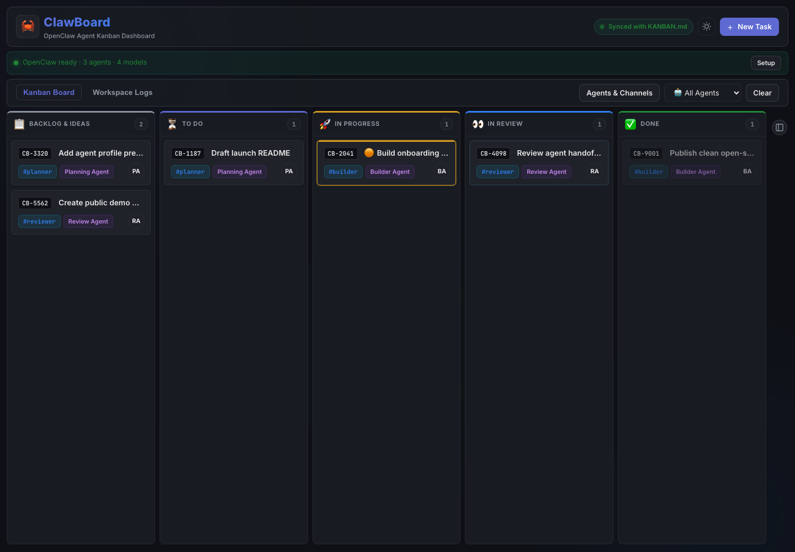
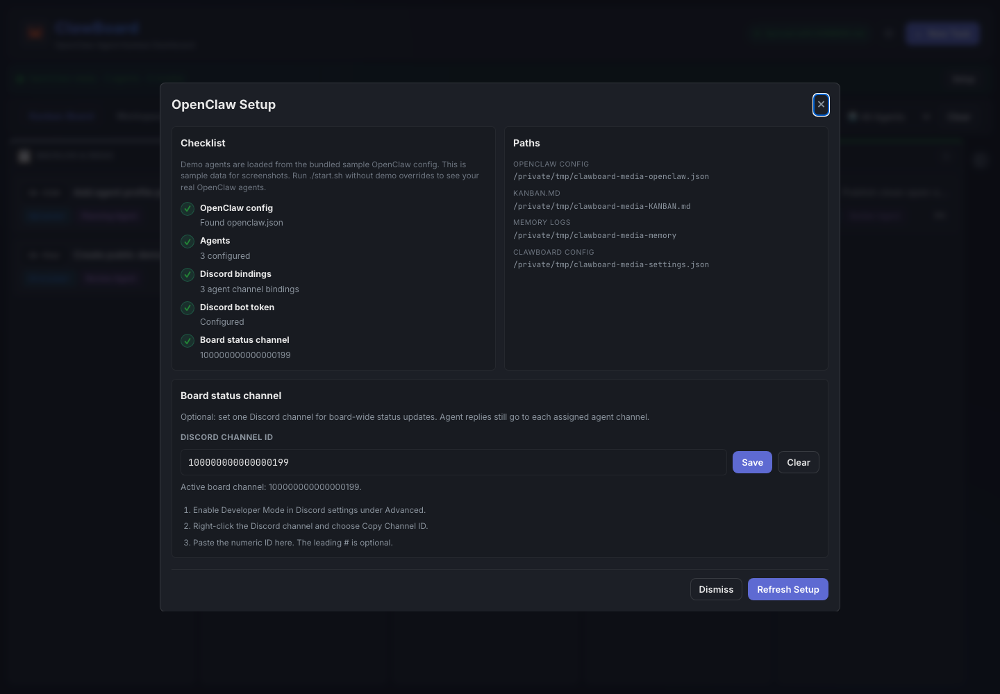
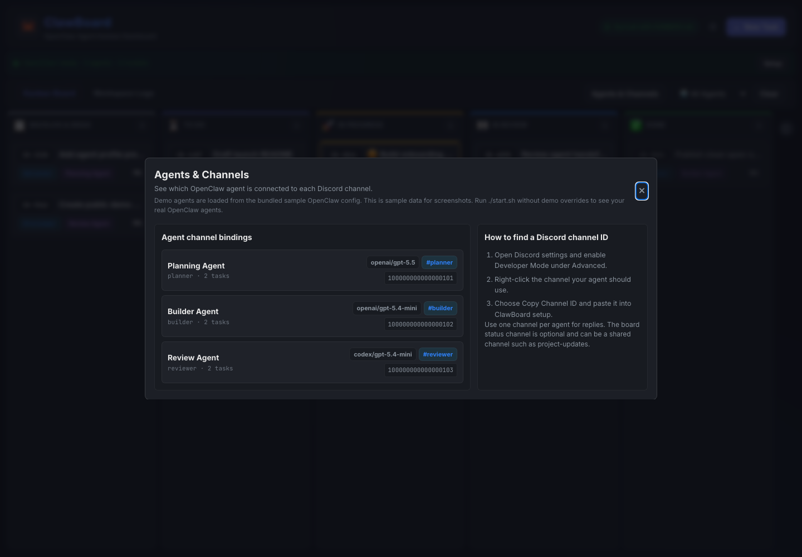

# 🦀 ClawBoard

**Agent-Powered Kanban Board for OpenClaw**

ClawBoard is an open-source Kanban dashboard for [OpenClaw](https://openclaw.ai) users who want a focused board for planning agent work, assigning tasks, and reviewing finished output. It reads your OpenClaw agents and Discord bindings, then gives you a visual workflow for moving work from idea to review.

If your OpenClaw agents can work in parallel, your bottleneck becomes planning and review. ClawBoard gives that loop a home: plan the ticket, assign the agent, review the result.

**Keywords:** OpenClaw Kanban, AI agent task board, Discord agent workflow, self-hosted project board, agent review queue.

## Demo







## ✨ Features

- **5 Swim Lanes**: Backlog → To Do → In Progress → In Review → Done
- **OpenClaw Integration**: Reads agents and Discord channel bindings from `~/.openclaw/openclaw.json`
- **Agent Model Selection**: Switch an agent's primary model from the sidebar and persist it back to OpenClaw config
- **Discord Notifications**: Status updates posted to assigned Discord channels via bot token
- **Drag & Drop**: Move cards between columns with validation rules
- **Within-Column Reorder**: Move cards up/down within the same column
- **Safe by Default**: Moving cards does not shell out to OpenClaw agents unless agent auto-start is explicitly enabled
- **Review Workflow**: Approve or reject tasks with feedback — agents get notified
- **Validation**: Can't move to "To Do" without assigning an agent and channel
- **Workspace Logs**: Browse OpenClaw memory logs with search and date filtering in the Logs tab
- **First-run Setup**: Guided setup checklist for config, agents, Discord bindings, and board status channel
- **Responsive Dark Dashboard**: Dense board layout, clean controls, and horizontal lanes for small screens

## 🚀 Quick Start

```bash
# Clone the repo
git clone https://github.com/vikramsinghvirdi/clawboard.git
cd clawboard

# Start the server
chmod +x start.sh
./start.sh
```

The board will open at `http://127.0.0.1:52837`

## 🎬 Demo Mode

For screenshots, walkthroughs, or a first look without touching your real OpenClaw workspace, run ClawBoard against the bundled sample data:

```bash
PORT=52942 \
OPENCLAW_CONFIG="$PWD/demo/openclaw.json" \
KANBAN_PATH="$PWD/demo/KANBAN.md" \
MEMORY_DIR="$PWD/demo/memory" \
BOARD_CHANNEL_ID=100000000000000199 \
node server.js
```

Then open `http://127.0.0.1:52942`.

The demo config uses placeholder Discord channel IDs and no real bot token, so it is safe for public screenshots and video.

## 📋 Prerequisites

- **Node.js** (v18+)
- **OpenClaw** configured with Discord (agents and channel bindings in `~/.openclaw/openclaw.json`)

On first run, ClawBoard creates `~/.openclaw/workspace/KANBAN.md` if it does not exist. The app also shows a setup banner when OpenClaw config, agents, Discord bindings, or the board status channel need attention.

## 🧭 First-Run Onboarding

Open ClawBoard and click **Setup**. The onboarding checklist verifies:

- `openclaw.json` was found
- agents are configured
- Discord channel bindings exist
- Discord bot token is configured
- optional board-wide status channel is configured

The setup dialog also shows the exact OpenClaw paths ClawBoard is using, which makes it easier to debug non-standard installs.

## ⚙️ Configuration

ClawBoard works with defaults from your current user account, but you can override paths and notification behavior with environment variables:

| Variable | Description |
|----------|-------------|
| `PORT` | Server port, defaults to `52837` |
| `OPENCLAW_CONFIG` | Path to `openclaw.json` |
| `KANBAN_PATH` | Path to the board markdown file |
| `MEMORY_DIR` | Path to OpenClaw memory/activity logs |
| `BOARD_CHANNEL_ID` | Discord channel for board status notifications |
| `CLAWBOARD_AUTO_INVOKE_AGENTS` | Optional. Set to `true` to let ClawBoard run `openclaw agent` when tasks enter In Progress |
| `CLAWBOARD_CONFIG` | Optional JSON config file for the same settings |

You can also place a JSON file at `~/.openclaw/clawboard.json` or `.clawboard.json` in the repo:

```json
{
  "boardChannelId": "123456789012345678",
  "kanbanPath": "/Users/you/.openclaw/workspace/KANBAN.md",
  "memoryDir": "/Users/you/.openclaw/workspace/memory",
  "autoInvokeAgents": false
}
```

Agent auto-start is off by default. This prevents ClawBoard from triggering Codex/OpenClaw command approval prompts for users who only want a visual Kanban board.

## 🏗️ Architecture

```
ClawBoard/
├── index.html    # Board UI with 5 columns, dialogs, sidebar
├── index.css     # Premium dark theme with animations
├── app.js        # Drag-drop, validation, Discord integration
├── server.js     # Node.js server — reads KANBAN.md + openclaw.json
├── start.sh      # Startup script
├── .gitignore
└── README.md
```

### How It Works

1. **Server** reads tasks from `~/.openclaw/workspace/KANBAN.md` (markdown-based persistence)
2. **Board UI** fetches agents and channels from OpenClaw config via API endpoints
3. **Drag-and-drop** moves tasks between columns with validation
4. **Discord notifications** are sent to `BOARD_CHANNEL_ID` when configured, or to the task's assigned channel as fallback
5. **Agent replies** are delivered to the assigned agent's Discord channel when your OpenClaw agents are run separately
6. **Optional auto-start** can run `openclaw agent` for In Progress tasks only when explicitly enabled
7. **Agent models** can be changed from the sidebar using models already listed in OpenClaw config
8. **Review workflow** lets you approve or reject agent work directly from the board

### Workflow

```
Plan → Assign → Agent works → Review → Done
```

ClawBoard is intentionally small: it is not a full issue tracker, and it does not replace OpenClaw. It is the visual planning and review layer for OpenClaw projects.

### Task Lifecycle

```
📋 Backlog → ⏳ To Do → 🚀 In Progress → 👀 In Review → ✅ Done
     │           │            │                │
     │  Requires │  Agent     │  Agent moves   │  You approve
     │  agent +  │  picks up  │  here when     │  or reject
     │  channel  │  the task  │  done working  │  with feedback
```

## 🔧 API Endpoints

| Endpoint | Method | Description |
|----------|--------|-------------|
| `/api/tasks` | GET | Get all tasks by column |
| `/api/tasks` | POST | Save all tasks (writes KANBAN.md) |
| `/api/agents` | GET | Get OpenClaw agents |
| `/api/models` | GET | Get available OpenClaw models |
| `/api/agent-model` | POST | Update one agent's primary model |
| `/api/channels` | GET | Get Discord channel bindings |
| `/api/notify` | POST | Send Discord notification |
| `/api/activity` | GET | Get workspace logs, optionally filtered with `?date=YYYY-MM-DD` |
| `/api/setup` | GET | Get onboarding/configuration status |
| `/api/settings/board-channel` | POST | Save or clear the board-wide Discord status channel |
| `/api/task-status` | POST | Move one task by id |
| `/api/task-details` | POST | Update one task description |

## 📄 License

MIT
